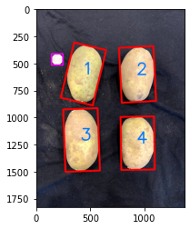

# Potato-Assessment-Application
This application is being developed for Washington State University potato research and breeding programs. The application assesses potato tubers specified by the user via images.

  

## Current Features

## Future Plans

## User Instructions
